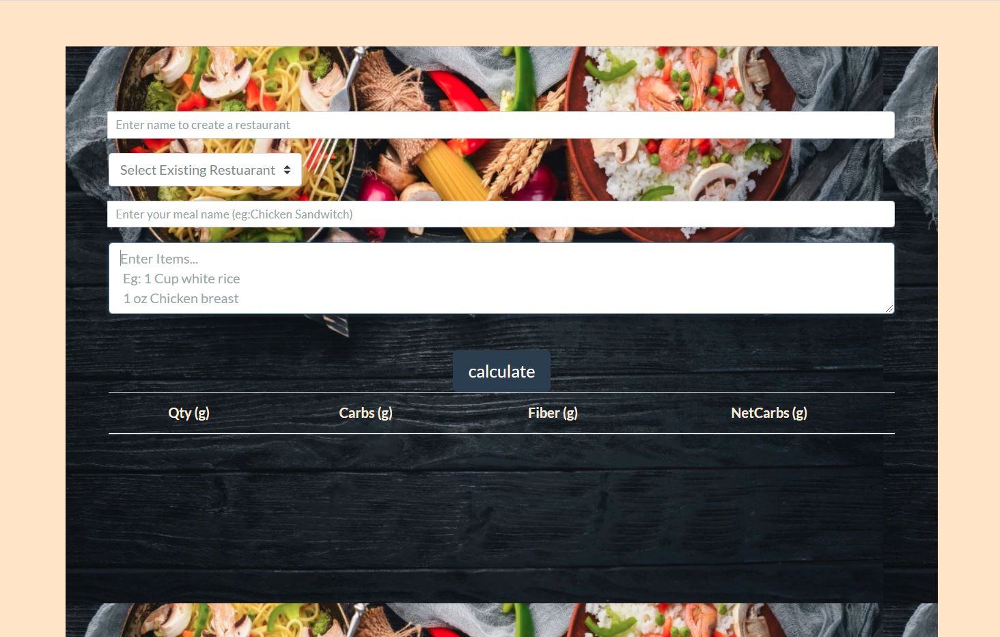

## Link to Live Application
https://appcarbtracker.herokuapp.com/

## Application Purpose
This application is meant for diabetics and health conscious people who want to keep track of carbohydrate intake. But going to restaurants the meals don't always have nutrition facts with carb amounts. With this app the user can quickly calculate the carb amount of any meal. Tools used: Edamam API, Node, Bootstrap, Express, SQL, HTML5, CSS3

## Start Application

In the project directory, you can run:
### `npm i`
and then run
### `npm start`

Runs the app in the development mode. 
Open [http://localhost:3000](http://localhost:3000) to view it in the browser.

The page will reload if you make edits. 
You will also see any lint errors in the console.

## Screenshot

